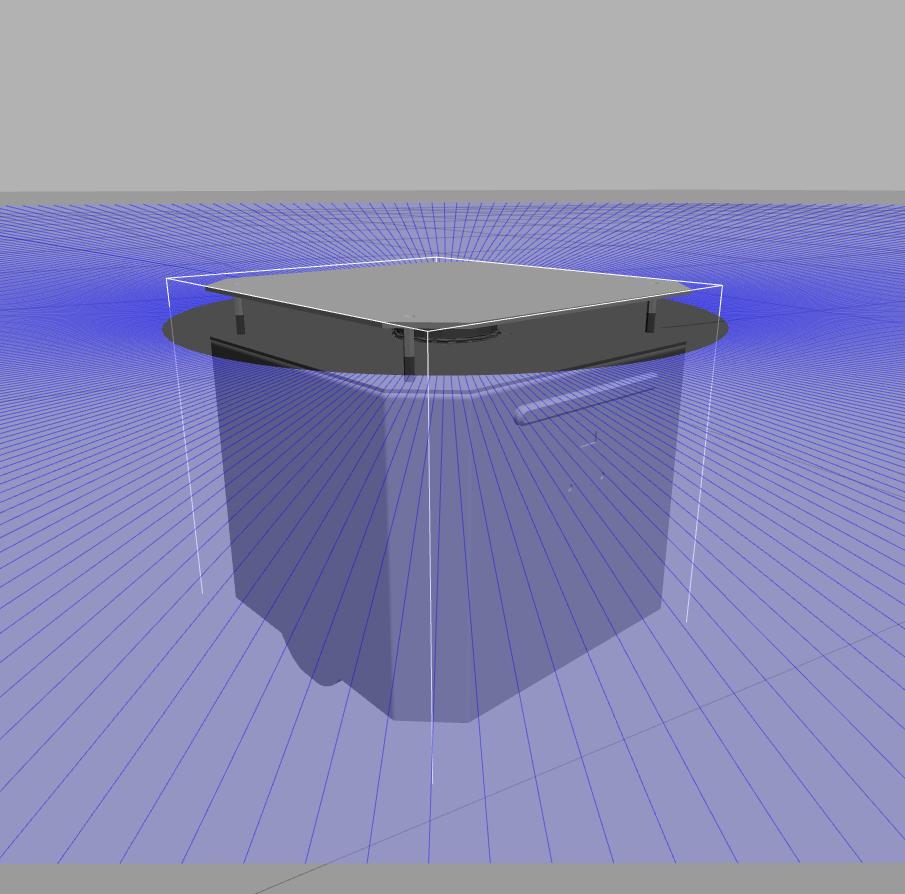
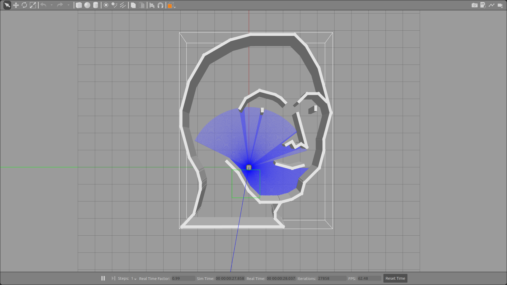
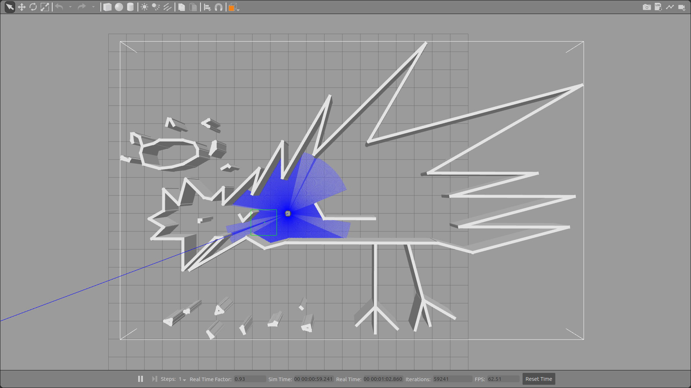
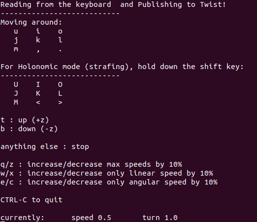
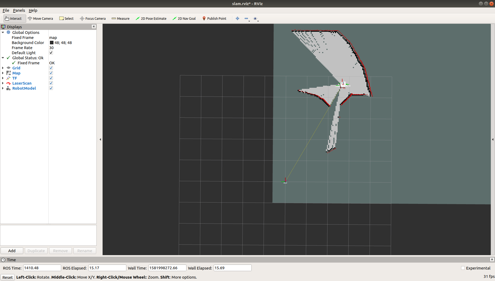
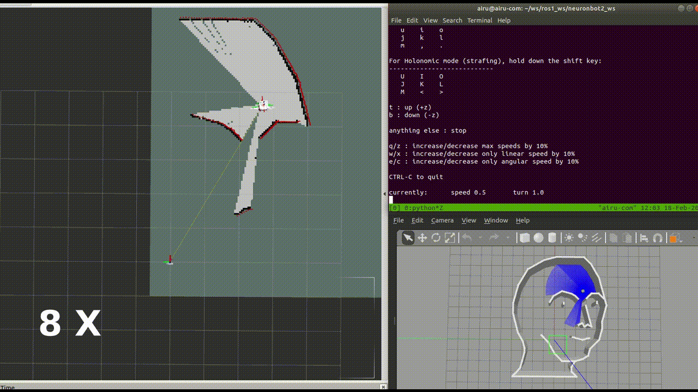
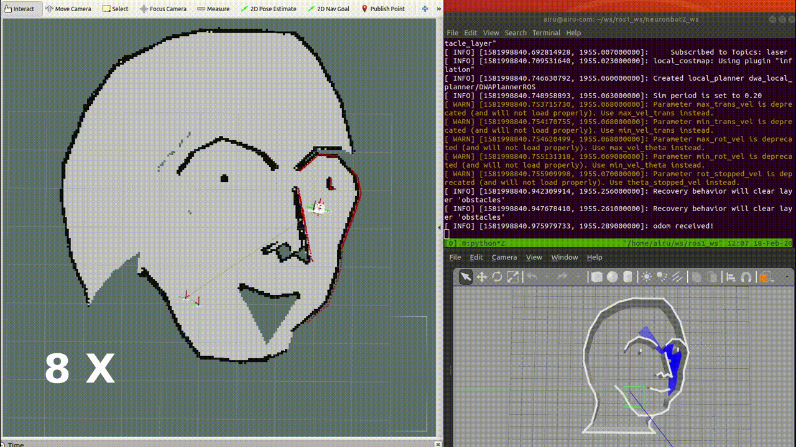
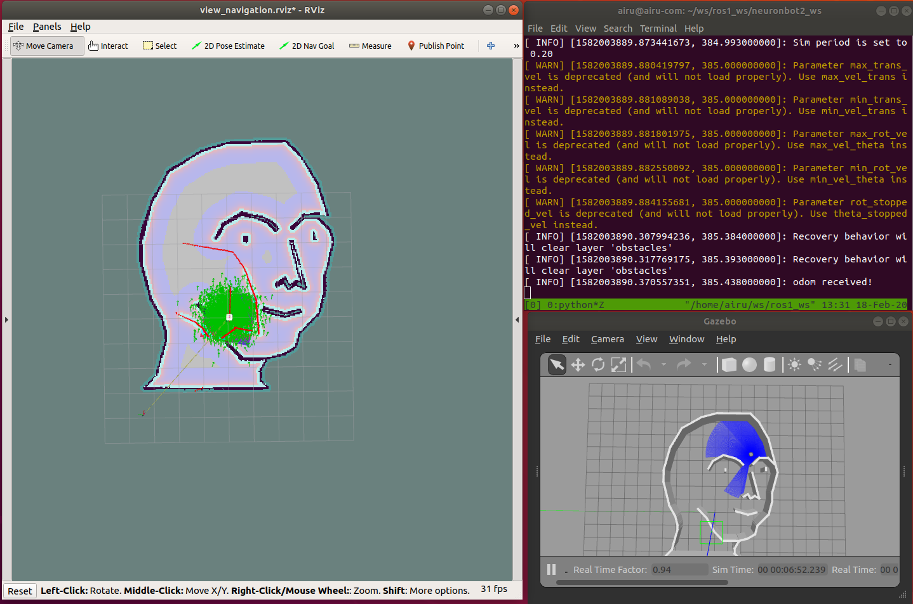
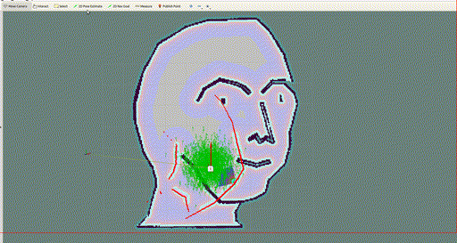

## NeuronBot 2 in ROS1
NeuronBot2 is the newest version of NeuronBot made by Adlink, which fully supports ROS1 and ROS2. 

### Features
* Nice
* Good
* Awesome
* Wonderful
* Magnificent
* Impressive
* Intimidating
* Stunning
* Extraordinary
* Superb
  

This package includes the functions to bring up the robot, to make it SLAM, to navigation, and to simulate it with your own computer, testing the same functions mentioned before. 

Now we support the following version, you can checkout to these branch.

- ROS 1 melodic
- ROS 1 noetic
- ROS 2 dashing
- ROS 2 eloquent
- ROS 2 foxy

# ROS1

## NeuronBot2 Setup

### Git Clone & Dependencies Installation
1. [Install ROS](http://wiki.ros.org/noetic/Installation/Ubuntu)
2. Create workspace
    ```
    mkdir -p ~/neuronbot2_ros1_ws/src
    cd ~/neuronbot2_ros1_ws/src
    ```
3. Git clone NeuronBot and RPLIDAR packages with noetic-devel branches
    ```
    git clone https://github.com/Adlink-ROS/neuronbot2.git -b noetic-devel
    git clone https://github.com/Adlink-ROS/rplidar_ros.git -b melodic-devel
    ```
4. Install dependencies
   ```
   cd ~/neuronbot2_ros1_ws/
   rosdep update
   rosdep install --from-paths src --ignore-src -r -y --rosdistro noetic
   ```
5. Initialze NeuronBot2 ttyUSB nodes
   `neuronbot_init.sh` is needed to be run only once for the first setup.
   ```
   cd ~/neuronbot2_ros1_ws/src/neuronbot2/neuronbot2_tools/neuronbot2_init/   
   sudo ./neuronbot2_init.sh
   ```

6. catkin_make 
   ```
   cd ~/neuronbot2_ros1_ws/
   source /opt/ros/noetic/setup.bash
   catkin_make
   source devel/setup.bash
   ```
## Simulation


Below document is the quick-start guide for simulation if you don't realy have a NeuronBot.

### Summon the NeuronBot2 into Gazebo
1. Specify the model path for Gazebo
   ```
   source /opt/ros/noetic/setup.bash
   source ~/neuronbot2_ros1_ws/devel/setup.bash
   export GAZEBO_MODEL_PATH=~/neuronbot2_ros1_ws/src/neuronbot2/neuronbot2_gazebo/models
   ```
2. Launch Gazebo simulation.
    
   ***There are two worlds for users to explore.***
   * Mememan world
   ```
   roslaunch neuronbot2_gazebo neuronbot2_world.launch world_model:=mememan_world.model
   ```
   
   * Phenix world
   ```
   roslaunch neuronbot2_gazebo neuronbot2_world.launch world_model:=phenix_world.model
   ```
   
3. Teleop it in the world

    Users are able to control the NeuronBot2 with the following rosnode. Run it with the other terminal.
   ```
   source /opt/ros/noetic/setup.bash
   rosrun teleop_twist_keyboard teleop_twist_keyboard.py
   ```
   
### SLAM the world
1. Launch SLAM as well as Rviz while the Gazebo simulation is running.
   ```
   roslaunch neuronbot2_slam gmapping.launch open_rviz:=true 
   ```
    
2. Teleop it to explore the world
   ```
   rosrun teleop_twist_keyboard teleop_twist_keyboard.py
   ```
   
3. Explore the world with move_base while SLAM with gmapping
   ```
   roslaunch neuronbot2_nav navigation.launch
   ```
   
4. Save the map
   ```
   source ~/neuronbot2_ros1_ws/devel/setup.bash
   roscd neuronbot2_nav/maps/
   rosrun map_server map_saver -f <map_name>
   ```

   Then, you shall turn off Gmapping.
### Navigate to the desired location
Once users obtain the map, the pgm file & yaml file, navigation is good to go.
1. Launch Navigation as well as Rviz while the Gazebo simulation is running.
   ```
   roscd neuronbot2_nav/maps/
   roslaunch neuronbot2_nav bringup.launch open_rviz:=true local_planner:=dwa map:=/path/map_name.yaml
   ```
   
   open_rviz: whether open RViz or not [default: false]
   
   local_planner: can be either dwa or teb [default: dwa]
   
   map: sholud be assigned to the absolute path. [default: neuronbot2_nav/maps/mememan.yaml]
   
   You can also change the default map file in neuronbot2_nav/launch/bringup.launch

    
2. Set Estimation
   
   Click "2D Pose Estimate", and set estimation to the approximate location of robot on the map.

   
3. Set Goal

   Click "2D Nav Goal", and set goal to any free space on the map.
   
   

### Other tips
1. Speed up simulation

    ```
    rosrun dynamic_reconfigure dynparam set gazebo time_step 0.002  # default is 0.001
    ```

### Troubleshooting
1. Why do I see "ERROR: cannot launch node of type [xxx] ..." ?
 
   ANS: You probably forgot to install dependent packages, please try below commands:

   ```
   cd ~/neuronbot2_ros1_ws/
   rosdep install --from-paths src --ignore-src -r -y --rosdistro $ROS_DISTRO
   ```

2. Why do I see "RLException: [xxx.launch] is neither a launch file in package [neuronbot2_xxx]" ?

   ANS: You probably forgot to source the environment of this workspace, please try below commands:
   ```
   source ~/neuronbot2_ros1_ws/devel/setup.bash
   ```
