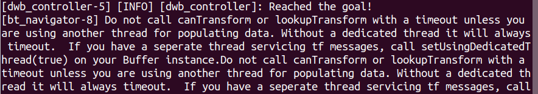

# NeuronBot 2 in ROS2
## Introduction
NeuronBot2 is the newest version of NeuronBot make by Adlink, which fully supports ROS1 and ROS2. 

### Features
* Nice
* Good
* Awesome
* Wonderful
* Magnificent
* Impressive
* Intimidating
* Stunning
* Extraordinary
* Superb
  

This package includes the functions to bring up the robot, to make it SLAM, to navigation, and to simulate it with your own computer, testing the same functions mentioned before. 

Users are able to checkout to different branch of this package to run on ROS1(melodic-version) and ROS2(dashing-version).
```
git clone https://github.com/airuchen/neuronbot2.git

# For ROS melodic
git checkout melodic-dev

# For ROS2 Dashing
git checkout dashing-devel
``` 

## Installation
------
Follow [this official installing tutorial](https://index.ros.org/doc/ros2/Installation/Dashing/Linux-Install-Debians/ "ros-dashing-desktop installation"). For the sake of convenience, you might want to download ros-dashing-desktop version to make sure all the dependencies are installed.
### Setup the workspace 
```
source /opt/ros/dashing/setup.bash
mkdir -p ~/neuronbot2_ros2_ws/src
cd ~/neuronbot2_ros2_ws
wget https://gist.githubusercontent.com/airuchen/dd5e7962706b32ffaa8d46ba905fea91/raw/d21c4fe2ca0d494202cf84c734c9e8cbca769ff1/NeuronBot2_ros2.repos
vcs import src < NeuronBot2_ros2.repos
rosdep install --from-paths src --ignore-src -r -y
colcon build --symlink-install
source ~/neuronbot2_ros2_ws/install/local_setup.bash
```


## Bring up your robot
TODO:

## Simulation quick-start guide

### Git Clone & Dependencies Installation
1. [Install ROS2](https://index.ros.org/doc/ros2/Installation/Dashing/Linux-Install-Debians/)
2. Create workspace
    ```
    mkdir -p ~/neuronbot2_ros2_ws/src
    ```
3. Git clone this package
    ```
    cd ~/neuronbot2_ros2_ws/
    wget https://gist.githubusercontent.com/airuchen/dd5e7962706b32ffaa8d46ba905fea91/raw/d21c4fe2ca0d494202cf84c734c9e8cbca769ff1/NeuronBot2_ros2.repos
    vcs import src < NeuronBot2_ros2.repos

    ```
4. Install dependencies
   ```
   cd ~/neuronbot2_ros2_ws/
   rosdep update
   rosdep install --from-paths src --ignore-src -r -y # Show my respect to this line
   ```
5. Colcon build the package 
   ```
   cd ~/neuronbot2_ros2_ws/
   source /opt/ros/dashing/setup.bash
   colcon build --symlink-install
   source ~/neuronbot2_ros2_ws/install/local_setup.bash
   ```
### Summon the NeuronBot2 into Gazebo
1. Specify the model path for Gazebo
   ```
   source /opt/ros/dashing/setup.bash
   source ~/neuronbot2_ros2_ws/install/local_setup.bash
   export GAZEBO_MODEL_PATH=~/neuronbot2_ros2_ws/src/neuronbot2/neuronbot2_gazebo/models
   ```
2. Launch Gazebo simulation.
    
   ***There are two worlds for users to explore.***
   * Mememan world
   ```
   ros2 launch neuronbot2_gazebo neuronbot2_mememan.launch.py
   ```
   
   * Phenix world
   ``` 
   ros2 launch neuronbot2_gazebo neuronbot2_phenix.launch.py
   ```
   
3. Teleop it in the world

    Users are able to control the NeuronBot2 with the following rosnode. Run it with the other terminal.
   ```
   source /opt/ros/dashing/local_setup.bash
   ros2 run teleop_twist_keyboard teleop_twist_keyboard
   ```
   

   ***p.s. To alleviate CPU consumption, close GAZEBO GUI by clicking x. This will not end the simulation server, which is running backend***
### SLAM the world
1. Launch SLAM as well as Rviz while the Gazebo simulation is running.
   
   ***We provide three slam methods.***

   * Gmapping
   ```
   ros2 launch  neuronbot2_slam gmapping.launch.py open_rviz:=true
   ```
   * Slam_toolbox
   ``` 
   ros2 launch  neuronbot2_slam slam_toolbox.launch.py open_rviz:=true
   ```
   * Cartographer
   ```
   ros2 launch  neuronbot2_slam cartographer.launch.py open_rviz:=true
   ```
    
2. Teleop NeuronBot2 to explore the world
   ```
   # Run on the other terminal
   source /opt/ros/dashing/setup.bash
   ros2 run teleop_twist_keyboard teleop_twist_keyboard
   ```
   
3. Save the map
   ```
   source /opt/ros/dashing/setup.bash
   cd ~/neuronbot2_ros2_ws/src/neuronbot2/neuronbot2_nav/map/
   ros2 run nav2_map_server map_saver -f <map_name>
   ```

   Then, you shall turn off SLAM.
### Navigate to the desired location
Once users obtain the map, the pgm file & yaml file, navigation is good to go.
1. Launch Navigation as well as Rviz while the Gazebo simulation is running. Default map is set to mememan.yaml.
    ```
    ros2 launch neuronbot2_nav neuronbot2_nav.launch.py map_dir:=/home/<user>/neuronbot2_ros2_ws/src/neuronbot2/neuronbot2_nav/map/<map_name>.yaml open_rviz:=true
    ```
    
2. Set Estimation
   
   Click "2D Pose Estimate", and set estimation to the approximate location of robot on the map.

   
3. Set Goal

   Click "2D Nav Goal", and set goal to any free space on the map.
   
   


## Trouble Shooting
1. If you see below warning messages after NeuronBot performing navigation, don't worry, it has been fixed at ROS 2 Eloquent.


<br/>