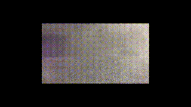
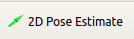
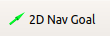
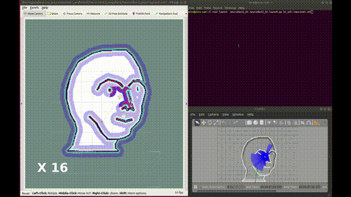

# NeuronBot2 in ROS 2


## Introduction
NeuronBot2 is the newest version of NeuronBot made by Adlink, which fully supports ROS 1 and ROS 2. 

### Features
* Nice
* Good
* Awesome
* Wonderful
* Magnificent
* Impressive
* Intimidating
* Stunning
* Extraordinary
* Superb
  

This package includes the functions to bring up the robot, to make it SLAM, to navigate, and to simulate it with your own computer, testing the same functions mentioned before. 

Users are able to checkout to different branches of this package to run on ROS 1 and ROS 2, please check different branches.

## Installation

1. [Install ROS 2](https://index.ros.org/doc/ros2/Installation/Foxy/Linux-Install-Debians/)
2. Install ROS 2 development tools
    ```
    sudo apt update && sudo apt install -y \
      build-essential \
      cmake \
      git \
      libbullet-dev \
      python3-colcon-common-extensions \
      python3-flake8 \
      python3-pip \
      python3-pytest-cov \
      python3-rosdep \
      python3-setuptools \
      python3-vcstool \
      openssh-server \
      wget
    ```

3. Git clone NeuronBot2 and other related sources
    ```
    mkdir -p ~/neuronbot2_ros2_ws/src
    cd ~/neuronbot2_ros2_ws/
    wget https://raw.githubusercontent.com/Adlink-ROS/neuronbot2_ros2.repos/foxy-devel/neuronbot2_ros2.repos
    vcs import src < neuronbot2_ros2.repos
    ```
4. Install other dependencies
   ```
   cd ~/neuronbot2_ros2_ws/
   source /opt/ros/foxy/setup.bash
   rosdep update
   rosdep install --from-paths src --ignore-src -r -y --rosdistro foxy
   ```
5. Initialze NeuronBot2 ttyUSB nodes,
   `neuronbot_init.sh` is needed to be run only once for the first setup. If you use NeuronBot2 for simulation only, not for the real robot, then you can skip this step.
   ```
   cd ~/neuronbot2_ros2_ws/src/neuronbot2/neuronbot2_tools/neuronbot2_init/   
   sudo ./neuronbot2_init.sh
   ```      
   
6. Colcon build the package 
   ```
   cd ~/neuronbot2_ros2_ws/
   source /opt/ros/foxy/setup.bash
   colcon build --symlink-install --cmake-args -DCMAKE_BUILD_TYPE=Release
   source ~/neuronbot2_ros2_ws/install/local_setup.bash
   ```

---

## Bring up your NeuronBot2


Now, it's time to launch your NeuronBot2 and do a Robotic-Hello-World thing -- teleop it.

If you are looking for the NeuronBot2 simulation, please jump to [Bring up in Simulation](https://github.com/Adlink-ROS/neuronbot2#bring-up-in-simulation).

### Launch NeuronBot2
Open a new terminal (Ctrl + Alt + t).
   ```
   source /opt/ros/foxy/setup.bash
   source ~/neuronbot2_ros2_ws/install/local_setup.bash
   ros2 launch neuronbot2_bringup bringup_launch.py
   ```
###  Teleop NeuronBot2
   ```
   source /opt/ros/foxy/setup.bash
   ros2 run teleop_twist_keyboard teleop_twist_keyboard
   ```
   Follow the hints and start to cruise your NeuronBot2.

   
### SLAM your map
1. Launch SLAM as well as Rviz.
   
   ***We provide three slam methods.***

   * Gmapping
   ```
   ros2 launch neuronbot2_slam gmapping_launch.py open_rviz:=true
   ```
   * Slam_toolbox
   ``` 
   ros2 launch neuronbot2_slam slam_toolbox_launch.py open_rviz:=true
   ```
   * Cartographer
   ```
   ros2 launch neuronbot2_slam cartographer_launch.py open_rviz:=true
   ```
2. Teleop NeuronBot2 to explore the world
   ```
   # Run on the other terminal
   source /opt/ros/foxy/setup.bash
   ros2 run teleop_twist_keyboard teleop_twist_keyboard
   ```
3. Save the map
   ```
   source /opt/ros/foxy/setup.bash    
   ros2 run nav2_map_server map_saver_cli -f <map_dir>/<map_name> --ros-args -p save_map_timeout:=10000
   ```

   The map is ready and SLAM can be turned off.
### Navigation

   * Try navigation on your own map. 
      ```
      ros2 launch neuronbot2_nav bringup_launch.py map:=<full_path_to_your_map_name.yaml> open_rviz:=true
      ```
1. Set Estimation
   
      

   Click "2D Pose Estimate", and set estimation to the approximate location of robot on the map.

2. Set Goal
 
   

   Click "2D Nav Goal", and set goal to any free space on the map.
   

--- 
## Bring up in Simulation

### Summon the NeuronBot2 into Gazebo
1. Specify the model path for Gazebo
   ```
   source /opt/ros/foxy/setup.bash
   source ~/neuronbot2_ros2_ws/install/local_setup.bash
   ```
2. Launch Gazebo simulation.
    
   ***There are two worlds for users to explore.***
   * Mememan world
   ```
   ros2 launch neuronbot2_gazebo neuronbot2_world.launch.py world_model:=mememan_world.model
   ```
   
   * Phenix world
   ``` 
   ros2 launch neuronbot2_gazebo neuronbot2_world.launch.py world_model:=phenix_world.model
   ```
   
3. Teleop it in the world

    Users are able to control the NeuronBot2 with the following rosnode. Run it with the other terminal.
   ```
   source /opt/ros/foxy/local_setup.bash
   ros2 run teleop_twist_keyboard teleop_twist_keyboard
   ```
   

   ***p.s. To alleviate CPU consumption, close GAZEBO GUI by clicking x. This will not end the simulation server, which is running backend***
### SLAM the world
1. Launch SLAM as well as Rviz while the Gazebo simulation is running.
   
   ***We provide three slam methods.***

   * Gmapping
   ```
   ros2 launch neuronbot2_slam gmapping_launch.py open_rviz:=true use_sim_time:=true
   ```
   * Slam_toolbox
   ``` 
   ros2 launch neuronbot2_slam slam_toolbox_launch.py open_rviz:=true use_sim_time:=true
   ```
   * Cartographer
   ```
   ros2 launch neuronbot2_slam cartographer_launch.py open_rviz:=true use_sim_time:=true
   ```
    
2. Teleop NeuronBot2 to explore the world
   ```
   # Run on the other terminal
   source /opt/ros/foxy/setup.bash
   ros2 run teleop_twist_keyboard teleop_twist_keyboard
   ```
   
3. Save the map
   ```
   source /opt/ros/foxy/setup.bash 
   ros2 run nav2_map_server map_saver_cli -f <map_dir>/<map_name> --ros-args -p save_map_timeout:=10000
   ```

   Then, you shall turn off SLAM.
### Navigate to the desired location
Once users obtain the map, pgm file, and yaml file, navigation is good to go.

1. Launch Navigation as well as Rviz while the Gazebo simulation is running. If you haven't finished SLAM to get the map files, no worries, you can use the default maps **mememan** and **phenix** we have built for you.

   * Bringup all navigation nodes with specific parameters
   ```
   ros2 launch neuronbot2_nav bringup_launch.py map:=$HOME/neuronbot2_ros2_ws/src/neuronbot2/neuronbot2_nav/map/mememan.yaml open_rviz:=true use_sim_time:=true   
   ```

   * Try navigation on your own map. ***Put the <map_name>.yaml and <map_name>.pgm into " ~/neuronbot2_ros2_ws/src/neuronbot2/neuronbot2_nav/map/ "***

   ```
   ros2 launch neuronbot2_nav bringup_launch.py map:=<map_name>.yaml open_rviz:=true use_sim_time:=true
   ```
   * Supported parameters and its value for launch files

      **map**: phenix.yaml | mememan.yaml (default)

      **open_rviz**: true | false (default)

      **use_sim_time**: true | false (default) # if you run navigation in simulation, then use_sim_time must be set to true

   * You can also run localization and navigation in separate terminals.

   ```
   # terminal 1
   ros2 launch neuronbot2_nav localization_launch.py use_sim_time:=true
   # terminal 2
   ros2 launch neuronbot2_nav navigation_launch.py use_sim_time:=true
   # terminal 3
   ros2 launch neuronbot2_nav rviz_view_launch.py use_sim_time:=true
   ```

    
2. Set Estimation
   
   Click "2D Pose Estimate", and set estimation to the approximate location of robot on the map.

   
3. Set Goal

   Click "2D Nav Goal", and set goal to any free space on the map.
   
   

### Control with Behavior Tree
To run this demo, users should execute Gazebo server and Navigation (with Rviz for visualization) first.

1. Open the other terminal and source the environment variables.
   ```
   source /opt/ros/foxy/setup.bash
   source ~/neuronbot2_ros2_ws/install/local_setup.bash
   ```
2. Run Behavior Tree

   Please go to check this repos: https://github.com/Adlink-ROS/BT_ros2
   

## Trouble Shooting
