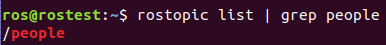
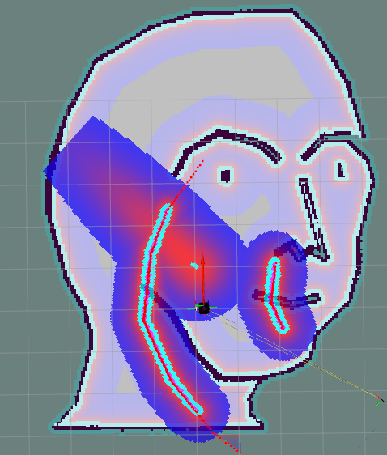

# Social Navigation Layer for ROS Melodic

## Prerequisite
1. Download NeuronBot2 source codes from [melodic-dev](https://github.com/skylerpan/neuronbot2/tree/melodic-dev) branch and setup the workspace by following NeuronBot2 instructions.
   
2. Checkout and switch to this (social_navigation_layer) branch to get modified local/global costmap settings.
   
3. After NeuronNot2 workspace is in `social_navigation_layer` branch, download these packages:
```
cd <nb2_workspace>/src/neuronbot2/
git clone https://github.com/QQting/navigation_layers.git -b melodic
git clone https://github.com/QQting/people.git -b melodic
```

3. Build all
```
cd <nb2_workspace>
rm -rf build devel   # remove old files
catkin_make
```

## Demo SOP

Run gazebo simulation:
```
export GAZEBO_MODEL_PATH=<nb2_workspace>/src/neuronbot2/neuronbot2_gazebo/models
roslaunch neuronbot2_gazebo neuronbot2_world.launch
```

Before starting navigation, please do source bash file to make sure you are not using built-in `people` and `social_navigation_layer` packages.
```
source devel/setup.bash
```

Run navigation
```
roslaunch neuronbot2_nav neuronbot2_nav.launch open_rviz:=true
```
While navigation is running, you can check whether the social_navigation_layer is enabled or not. If it is successfully enabled then you should see `/people` in the topic list.



Now we can fake a static object whose position is `[1.0,0.0]` and predict velocity is `[3.0,3.0]` on the `map` frame by enter below command.
```
rosrun people_velocity_tracker static.py map 1.0 0.0 3.0 3.0
```

The result is like below:


